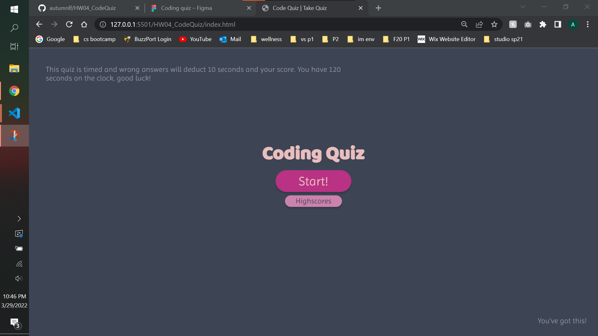
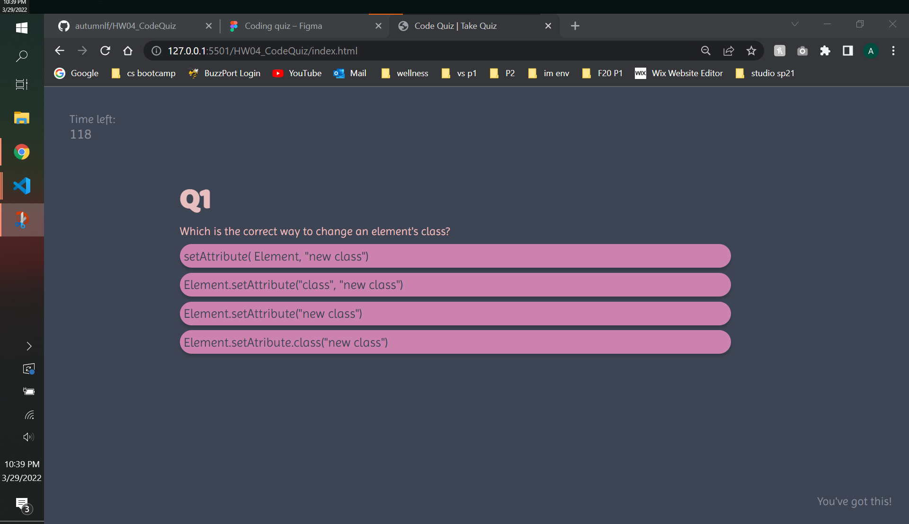
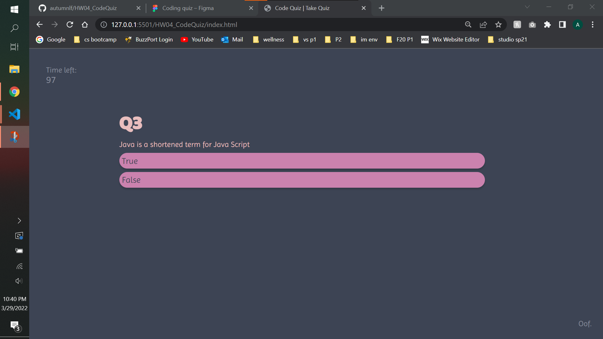
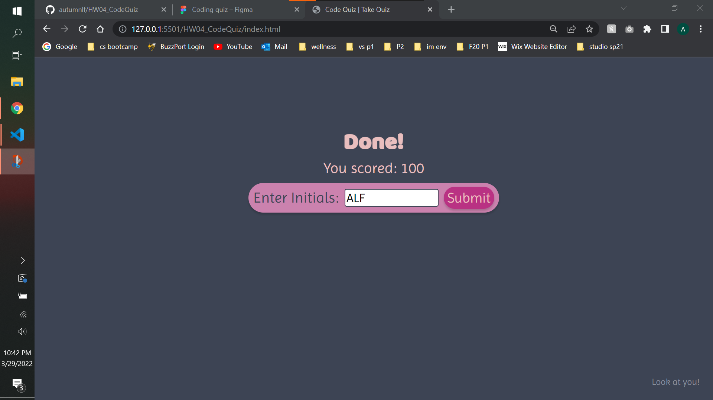
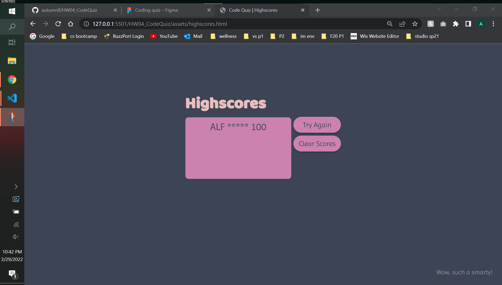

# HW04_CodeQuiz

**Link to deployed application:**
>https://autumnlf.github.io/HW04_CodeQuiz/

## Description
In this assignment I was tasked with creating a Code Quiz with a series of multiple choice questions. This quiz also needs to feature a timer and score system. A highscore page to track scores is also included.

For my quiz I give the user 2 minutes to answer 5 questions. However if you answer a question wrong, 10 seconds will be taken off the clock. If you run out of time, the score will be a zero. If the test taker can through the series of questions in time, they will receive 20 points per correct answer. 

## Screenshots:

